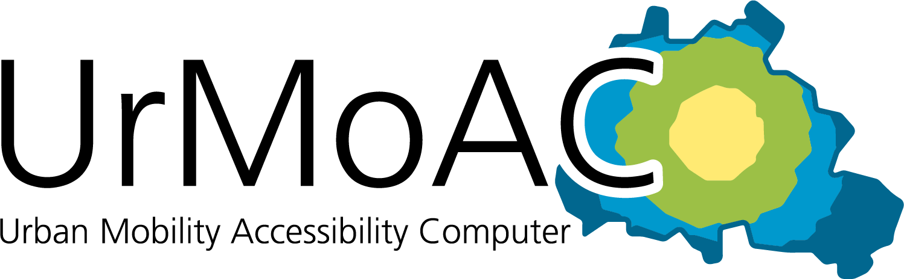

# UrMoAC

&ldquo;Urban Mobility Accessibility Computer&rdquo; or &ldquo;UrMoAC&rdquo; is a tool for computing accessibility measures, supporting aggregation, variable limits, and intermodal paths. It is a scientific tool.

While a large variety of accessibility measures exists, the tool computes only so-called &ldquo;contour measures&rdquo;. Basically, contour measures describe how many activity places can be accessed starting at a given location within a given amount of time. Even though the tool includes different limits and options, the computed measures still belong to the class of contour measures.

What the tool basically does is to load a set of origin locations and a set of destination locations as well as a road network and optionally a description of the public transport offer. Then, it iterates over all loaded origins and computes the respective accessibility measure for each of them by routing to all destinations within the defined limit. Optionally, areas by which the origins and destinations shall be aggregated may be loaded.

Some features:

* input is read from databases or files;
* variable origins / destinations;
* variable aggregation options;
* weights for origins and destinations;
* flexible limits for search: max. time, max. distance, max. number, max. seen value, nearest only;
* support for different transport modes, as well as intermodal accessibilities;
* GTFS-based public transport accessibility computation;
* possibility to read time-dependent travel times (for motorised individual traffic);
* penalties at crossings (experimental);
* support for intermodal paths beyond using public transport (experimental);
* support for data preparation and visualisation.

The tool has been developed at the [Institute of Transport Research](http://www.dlr.de/vf) of the [German Aerospace Center](http://www.dlr.de).

Its methods are described in [[1]](Publications.md#1), yet this document might be outdated. We hope to include a sufficient and up-to-date documentation here. Please let us known when something is missing.

**When using it, we ask you to cite it as:**

[1] Krajzewicz, Daniel und Heinrichs, Dirk und Cyganski, Rita (2017) [_Intermodal Contour Accessibility Measures Computation Using the &lsquo;UrMo Accessibility Computer&rsquo;_](https://elib.dlr.de/118235/). International Journal On Advances in Systems and Measurements, 10 (3&4), pp. 111&ndash;123. IARIA.

and/or use UrMoAC's DOI (v0.10.0): 

