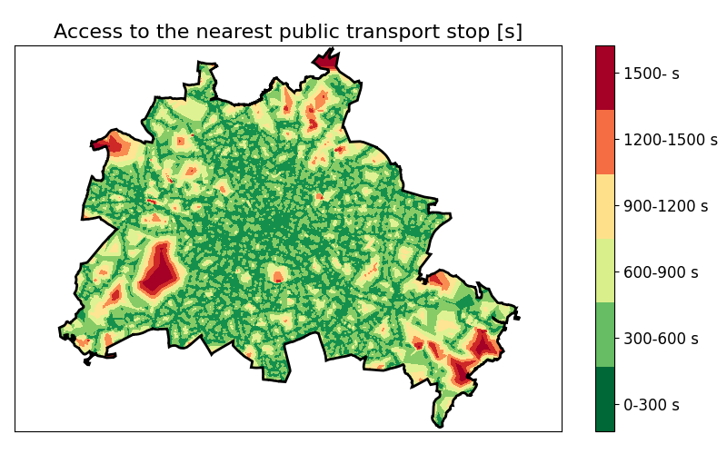

# Tutorial: Computing the accessibility to the next public transport halt

## Task
Computing the access to the next public transport halt within a region is a very common use case for UrMoAC. Within this tutorial, a basic usage of the tool for this purpose is described and discussed.


## Prerequisites

For the first, you will need the following tools and applications:

* UrMoAC
* [Java](https://projects.eclipse.org/projects/adoptium.temurin)
* [Python](https://www.python.org/)
* [PostgreSQL](https://www.postgresql.org/) with [PostGIS](https://postgis.net/) extensions

We will describe below how you can get the data.


## Basic Computation

### Step 1: get the data
Download an area you are interested in from [OpenStreetMap](http://www.openstreetmap.org). We will use a representation of the city of Berlin for our examples. This data already contains buildings, public transport halts, and a road network. Please note that the quality of [OpenStreetMap](http://www.openstreetmap.org) differs between regions. For Germany, the data is quite complete and up-to-date.

As said, we will use the city of Berlin as an example. We use a data set available on [Geofabrik](https://download.geofabrik.de/). the one we used was generated on the 28<sup>th</sup> of April 2023.

### Step 2: import the data into a database

Now, you should open a command line interface (shell / cmd.exe) and navigate to UrMoAC&#39;s OpenStreetMap tools&#39; folder. It is located in the subfolder ```tools/osm```.


#### Step 2.1: import OSM data
UrMoAC comes with a Python script named [osm2db.py](./ImportScripts.md#importing-openstreetmap-into-the-database) for importing [OpenStreetMap](http://www.openstreetmap.org) data into a database. My call for importing the downloaded and extracted OSM-file into my local database is as following:

```console
...\tools\osm>python osm2db.py localhost,urmoac,berlin,osm20230428,<USER>,<PASSWD> data\berlin-latest.osm
```

Please note that you need the PostGis extensions to be installed. If not, use:

```sql
CREATE EXTENSION postgis;
```

As described in the section about [import scripts](ImportScripts), [osm2db.py](./ImportScripts.md#importing-openstreetmap-into-the-database) gets the definition of the database to generate as the first, and about the file to parse as the second parameter. The format of the first (see [import scripts](ImportScripts) ) is _&lt;HOST&gt;_,_&lt;DB&gt;_,_&lt;SCHEMA&gt;_,_&lt;PREFIX&gt;_,_&lt;USER&gt;_,_&lt;PASSWD&gt;_.

The tool builds the tables as given in [import scripts](ImportScripts) and reports about inserting nodes, ways, and relations. It takes some time, for Berlin, with 6.6Mio nodes, 1Mio ways, and 16k relations, my computer needed about five minutes.

#### Step 2.2: prepare the road network
As described in [import scripts](ImportScripts), you may use the [osmdb_buildWays.py](./ImportScripts.md#building-the-road-network-from-openstreetmap-data) script to build your road network from a previously imported OSM data. In our case, the call is: 

```console
...\tools\osm>python osmdb_buildWays.py localhost,urmoac,berlin,osm20230428,<USER>,<PASSWD>
```

You may note that the tool reports about unknown highway or railway tags. Usually, these are yet unbuilt or even erased roads. For importing the road network of Berlin (about 1.2Mio edges), the tool needed about seven minutes.

#### Step 2.3: prepare the buildings (origins)
Use the tool [osmdb_buildStructures.py](./ImportScripts.md#using-openstreetmap-data-to-build-tables-of-certain-structures) to import buildings by calling:

```console
...\tools\osm>python osmdb_buildStructures.py localhost,urmoac,berlin,osm20230428,<USER>,<PASSWD> structure_defs/def_buildings.txt localhost,urmoac,berlin,osm20230428_buildings,<USER>,<PASSWD>
```

You will obtain a table named &ldquo;osm20230428_buildings&rdquo; that includes the buildings. The process took about 1 minute on my computer.

#### Step 2.4: prepare the public transport halts (destinations)
Again, you may use [osmdb_buildStructures.py](./ImportScripts.md#using-openstreetmap-data-to-build-tables-of-certain-structures) to import public transport halts. The call is:

```console
...\tools\osm>python osmdb_buildStructures.py localhost,urmoac,berlin,osm20230428,<USER>,<PASSWD> structure_defs/def_pt_halts.txt localhost,urmoac,berlin,osm20230428_pthalts,<USER>,<PASSWD>
```

You will obtain a table named &ldquo;osm20230428_pthalts&rdquo; that includes the public transport halts.

#### Step 2.5: prepare the city boundary
For a nicer visualisation, we need Berlin's boundary. Again,  [osmdb_buildStructures.py](./ImportScripts.md#using-openstreetmap-data-to-build-tables-of-certain-structures) is used. The call is:

```console
...\tools\osm>python osmdb_buildStructures.py localhost,urmoac,berlin,osm20230428,<USER>,<PASSWD> structure_defs/def_city_boundaries.txt localhost,urmoac,berlin,osm20230428_boundary,<USER>,<PASSWD>
```

You will obtain a table named &ldquo;osm20230428_boundary&rdquo; that includes the city boundaries.

### Step 3: compute the accessibility
After having imported our data, we can simply run UrMoAC for computing the access to the next public transport halt.

The call looks like the following:

```console
...\bin>java -jar UrMoAC.jar --from "jdbc:postgresql://localhost/urmoac,berlin.osm20230428_buildings,<USER>,<PASSWD>" --from.geom centroid --to "jdbc:postgresql://localhost/urmoac,berlin.osm20230428_pthalts,<USER>,<PASSWD>" --to.geom centroid --net "jdbc:postgresql://localhost/urmoac,berlin.osm20230428_network,<USER>,<PASSWD>" --time 28800 --mode foot --epsg 25833 --od-output "jdbc:postgresql://localhost/urmoac,berlin.osm20230428_houses2pthalts,<USER>,<PASSWD>" --verbose --shortest
```

The options mean the following:

* __--from "jdbc:postgresql://localhost/urmoac,berlin.osm20230428_buildings,&lt;USER&gt;,&lt;PASSWD&gt;"__: use the buildings stored in the database table berlin.osm20210310_buildings as origins
* __--from.geom centroid__: use the generated centroids as origins' positions
* __--to "jdbc:postgresql://localhost/urmoac,berlin.osm20230428_pthalts,&lt;USER&gt;,&lt;PASSWD&gt;"__: use the public transport halts stored in the database table berlin.osm20210310_buildings as destinations
* __--to.geom centroid__: use the generated centroids as destinations' positions
* __--net "jdbc:postgresql://localhost/urmoac,berlin.osm20230428_network,&lt;USER&gt;,&lt;PASSWD&gt;"__: use the network stored in berlin.osm20181028_network for routing
* __--time 28800__: we do need the time definitions; eventually, this is irrelevant for most modes
* __--mode foot__: define that we want to compute accessibilities for walking
* __--epsg 25833__: define the projection
* __--od-output "jdbc:postgresql://localhost/urmoac,berlin.osm20230428_houses2pthalts,&lt;USER&gt;,&lt;PASSWD&gt;"__: write a basic output to the database table osm20230428_houses2pthalts
* __--verbose__: report what you do
* __--shortest__: we want the access to the next public transport halt

Given this, the tool will generate the table &ldquo;berlin.osm20230428_houses2pthalts&rdquo; which contains the following information for each origin (building) stored row-by-row:

* __fid__: the ID of origin (building in this case)
* __sid__: the ID of the destination (the next PT stop in this case)
* __avg_distance__: distance in meters (not the average one, as no aggregation took place)
* __avg_tt__: travel time in seconds (not the average one, as no aggregation took place)
* __avg_num__: always -1, as we did not define a weight
* __avg_value__: always -1, as we do not aggregate
 
 
### Step 4: display the results

>ou can now visualise the results. UrMoAC comes with Python-scripts for visualisation and we simply use one of them, namely 
[plot_area.py](./VisualisationTools.md#plot_area). The call is as following:


```console
...\tools\visualisation>python plot_area.py --from localhost,urmoac,berlin,osm20230428_buildings,postgres,postgres -m localhost,urmoac,berlin,osm20230428_houses2pthalts,postgres,postgres --from.geom centroid --border localhost,urmoac,berlin,osm20230428_boundary,postgres,postgres --title "Access to the nearest public transport stop" 
--output berlin_building2pt.png
```

You will get a .png-file named &ldquo;berlin_building2pt.png&rdquo; that contains the following image:

# 


## Discussion

Ok, you can now compute and visualise accessibilities measures.

Congratulations!


