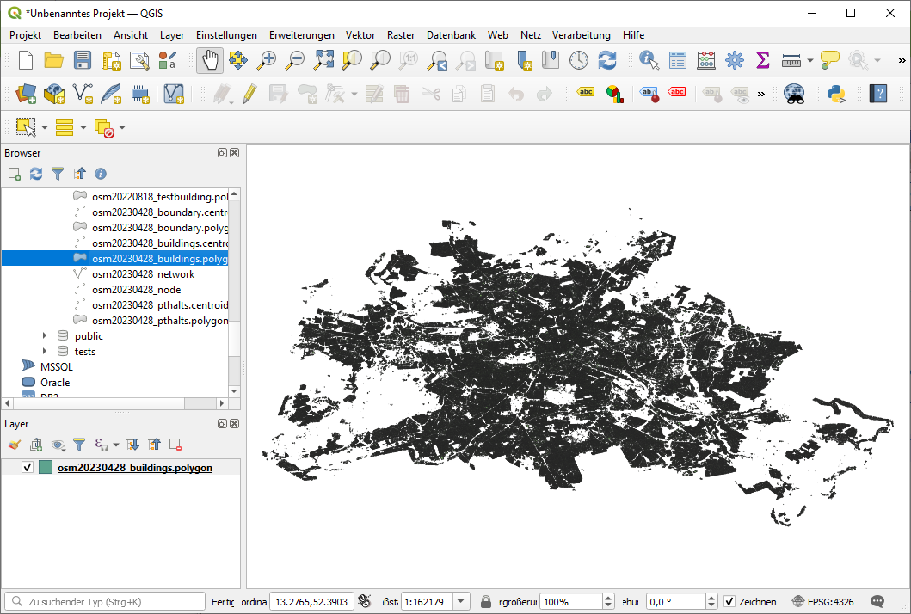

# Tutorial: Using QGIS to visualise UrMoAC results

## Task
Most of the visualisation we do is done using Python and matplotlib. But you may as well use usual geo information systems (GIS) for this purpose. This tutorial shows how to visualise UrMoAC results with [QGIS](https://www.qgis.org/).

## Prerequisites
Let&apos;s assume you&apos;d have computed the accessibility from buildings to the next public transport halt as described within the tutorial &#8220;[Computing the accessibility to the next public transport halt](TutorialNextPTHalt.md)&#8221;.

This means, you have the following tables:

* __berlin.osm20230428_network__: the road network
* __berlin.osm20230428_buildings__: the buildings
* __berlin.osm20230428_pthalts__: the public transport halts
* __berlin.osm20230428_houses2pthalts__: the accessibility values computed using UrMoAC

## Visualisation using QGIS
Start [QGIS](https://www.qgis.org/) and load the buildings first. You may have to add your database server to the list of known servers and open the path (host-scheme-table) to the buildings table. You may note that the OSM-importer [osmdb_buildStructures.py](../importer/OpenStreetMap.md#using-openstreetmap-data-to-build-tables-of-certain-structures) has generated two different geometry columns &#8212; one with the centroids (as points) and one with polygons. Open __berlin.osm20230428_buildings.polygon__. You should see something like what is shown in the following image.

# 

They are stored in WGS84 (EPSG 4326), so let&#39;s apply a proper projection, which is 25833 in Berlin&#39;s case. The result looks more like Berlin:

# 

Now, load the accessibility table by choosing the menu &#8220;Database -&gt; DB Manager&#8221;. The table __berlin.osm20230428_houses2pthalts__ with the previously generated results should be selectable in your database tree. Double-click on it to add it to the project.

Now, connect the buildings to the __osm20230428_houses2pthalts__ table. For this purpose, select the layer __berlin.osm20230428_buildings.polygon__ and double-click on it. In the next menu choose &#8220;Joins&#8221;. Add a connection between the &#8220;id&#8221; field of __berlin.osm20230428_buildings.polygon__ and the &#8220;fid&#8221; field of __osm20230428_houses2pthalts__ &#8212; because &#8220;fid&#8221; were our origins.

Now, select the layer&#39;s visualisation tab &#8220;Symbology&#8221;. Choose &#8220;Graduated&#8221; instead of &#8220;Single symbol&#8221; and &#8220;osm20230428_houses2pthalts_avg_tt&#8221; for value. Set the number of classes to 20 and press &#8220;Classify&#8221;. Select a nice color map. In the following image, the inversed &#8220;RdYlGn&#8221; is used. You may want to remove the borders of the polygons. The result are buildings colored by their travel time to the next public transport halt, as shown in the following image.

# 

Yes, most of the area is white&#8230; Let&#39;s zoom at our institute&#39;s location, add the road network, and the public transport halts&#8230;. You will get a map that shows the time needed to access the next public transport halt by foot.

# 

## Discussion

Well, this was a very fast example for using [QGIS](https://www.qgis.org/) to visualise the results.

The major takeaway is that you have to connect a geographical representation of your origins (or destinations) with the measures generated by UrMoAC.

